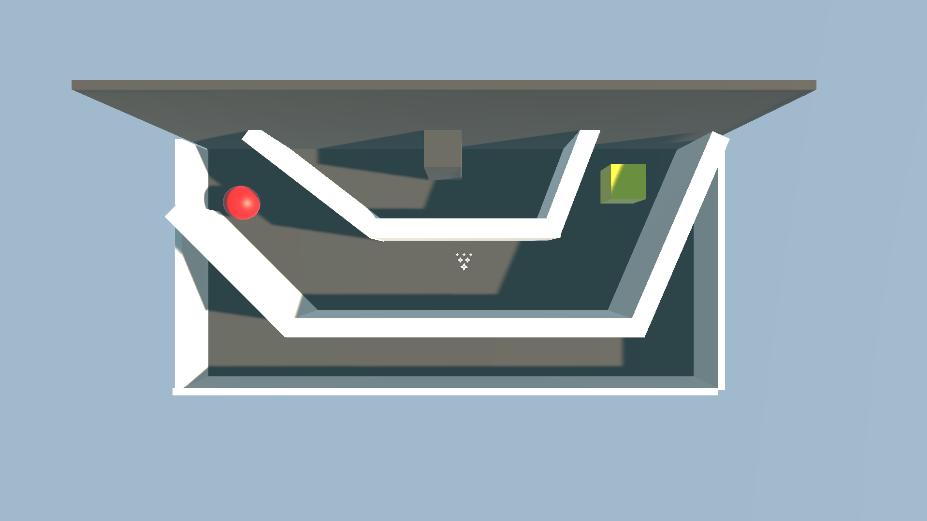
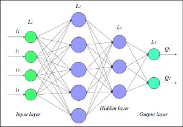
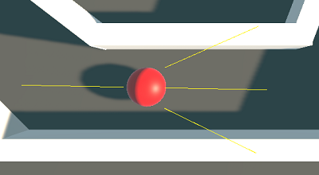
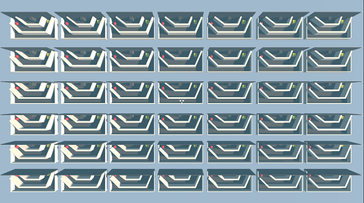
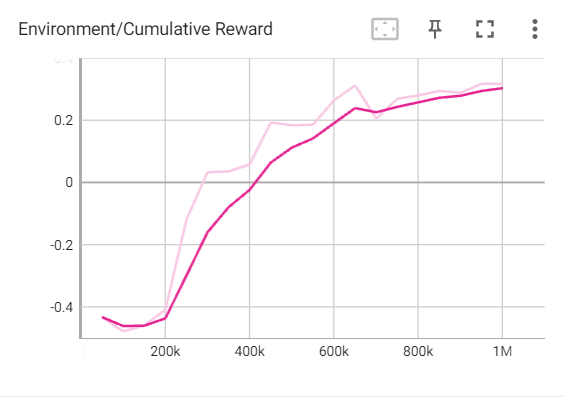
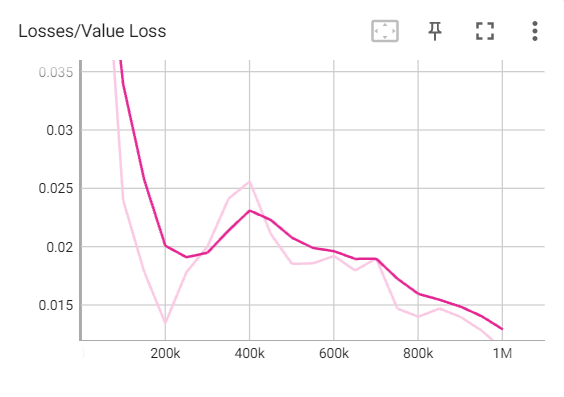
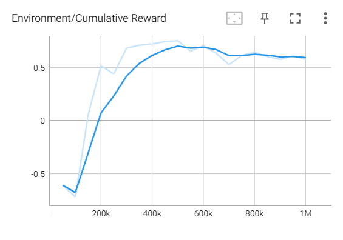
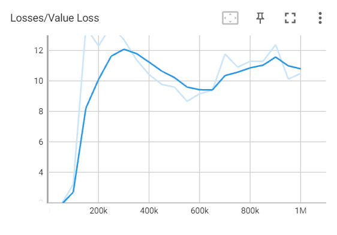

# Ball learn to escape - Application of Deep Learning

## Abstract

This paper analyzes the use of a machine learning algorithm to build a model trained to solve an "escape room" game. In this game, the model has to control a ball that needs to be moved to reach the destination.  
Model training involves the use of a neural network. The analysis consists of using two machine learning algorithms – Reinforcement Learning (RL) and Generative Adversarial Imitation Learning (GAIL). 
  
In determining the efficiency, the number of generations to be trained, respectively the total training time, as well as the parameters of the model to be trained will be taken into account. After training, the model will be tested in the simulated game environment to see how well it can complete the game. 
  
The aim of the project is also to provide an analysis of the limitations of machine learning algorithms, as well as the opportunities offered by GAIL-type architectures.

## I. Introduction 

A growing number of AI projects rely on learning a mapping between observations and actions. For technical reasons, learning by demonstration will play a crucial role in the development and use of algorithms for robots, video games or autonomous vehicles.  
As several computer science researchers have explained, in order to make decisions, humans create specific rules. For this reason, it is essential for a machine to accurately mimic how humans behave in different scenarios, such as video games. Learning by imitation facilitates the ability to perform complex tasks with minimal knowledge.  
However, specialized algorithms are required to effectively train a model. As we will see next, reinforcement learning methods are limited.  
Generative Adversarial Imitation Learning (GAIL) is a machine learning technique that allows a machine learning agent to imitate the behavior of an expert to perform a specific task. This is done by creating a competition between two models: a discriminator model and a generator model. The discriminator model is trained to distinguish between expert actions and actions generated by the generative model. The generative model learns to mimic the expert's behavior by producing actions that lead observers to believe they are produced by the expert. During training, the discriminator model and the generator model face off in a competition, which causes them to improve each other. The discriminator tries to identify and distinguish the actions of the expert from those generated by the generator model, and the generator tries to produce actions that confuse the discriminator and be considered to be produced by the expert.  
Although the networks used in GAIL could find correlations between the data provided as input, there are some challenges associated with training these networks. These include gradients that vanish or affect the convergence of the training algorithm. The difficulty of training these networks is mainly due to the adversarial process between the generator and the discriminator. GAIL uses two neural networks trained in a duel, in the form of a game, so that any improvement to the generator or discriminator involves changing the parameters of the other model.  

## II. Problem description

### A. Using imitation learning in video games

GAIL can be used to train artificial intelligence agents to play video games at a high level. To this end, the technique can be used to mimic the behavior of expert human video game players.  
In this work, the GAIL technique was used to create a model that imitates the way a human player plays in an Escape room game. This game consists of moving a ball along a tunnel to reach the destination. The difficulty lies in the low spin ability of the ball, which requires increased attention from the player and great precision in controlling its movement. The game map is illustrated in Fig. 1.

<h5 style="text-align: center;">Fig. 1. Map of the game</h5>

### B. Neural network description
The term "neural network" originated from attempts to find mathematical representations of information processing in biological systems (McCulloch and Pitts, 1943; Widrow and Hoff, 1960; Rosenblatt, 1962; Rumelhart et al., 1986). From the perspective of practical applications of pattern recognition,
biological realism would impose completely unnecessary constraints. Therefore, in the proposed problem it was desired to focus on neural networks as effective models for statistical pattern recognition.

<h5 style="text-align: center;">Fig. 2. Diagram of the neural network</h5>

### C. Algorithms used
To train the model, two machine learning algorithms were used: Reinforcement Learning and Generative Adversarial Imitation Learning.  
1. Reinforcement learning involves training an agent through a system of rewards and punishments. The goal is for the agent to make decisions that maximize the rewards received and minimize the punishments. The algorithm works like this: the agent takes an action in a specific state, and the environment responds by moving to a new state and providing a reward.
  
2. Generative Adversarial Imitation Learning combines two neural networks: a generator and a discriminator. The goal is to teach the agent to mimic the behavior of experts, usually human, in a given environment.

## III. IMPLEMENTATION OF THE ALGORITHM

To test the proposed models, we created an agent (the ball, in the case of the game) and used the two previously discussed algorithms using neural networks.

### A. Properties of Agent

To interact with the environment, the agent has four sensors attached, which determine the distance to the first object they intersect, normalized distance in the interval [0,1]. If the sensor does not intersect with any object, it will return -1. Three sensors are positioned at the front, and the fourth at the back, as can be seen in Fig. 3.

<h5 style="text-align: center;">Fig. 3. 
The ball uses its four sensors to get information from its surroundings</h5>

 
The travel speed has a coefficient of 1.5, and the rotation speed has a coefficient of 0.3. These coefficients make it difficult to move along the tunnel, as it requires increased attention to detail and quick reactions from the player.
  

### B. Neural network
The neural network consists of four layers of neurons: an input layer, two intermediate layers, and an output layer. 
• The input layer consists of four neurons, which represent the data provided by the sensors. 
• In between, there are two layers made up of 128 neurons. 
• The output contains a layer consisting of two neurons. They represent the properties that describe the movement of the agent. The first value describes the rotation of the ball around its own axis, and the second the acceleration.  
The agent will learn automatically using a technique called Proximal Policy Optimization (PPO). PPO uses the neural network to approximate the ideal function that maps the agent's observations to the best decisions it can make at a given point in time.
  
To maximize the results of the technique, the parameters of the algorithm must be adjusted. For the present problem, the following values ​​were chosen: 
• Learning rate (how fast the network coefficients will change): 0.003. 
• Buffer size (how many observations will be collected until the model is updated): 10240. 
• Beta (regularization coefficient, to prevent overfitting): 0.005. 
• Gamma (factor describing the interest of the agent to obtain rewards): 0.99.  
To speed up the learning process, 42 agents trained in parallel were used, which cumulatively executed 1,000,000 episodes.

<h5 style="text-align: center;">Fig. 4. 
The disposition of the 42 agents that learn in parallel</h5>

 

### C. Experiment: Reinforcement Learning

In the reinforcement learning algorithm, each stage consists of an episode. The agent will make random decisions, which it will classify in the end as good or bad decisions, based on the reward it will receive.  
The awarding of the agent is done in the following way: if he passes each checkpoint located on the map, he will receive 0.5 points, and if he reaches the destination he will receive another point; if it hits one of the walls, the score will be −1 and the episode will end.  
The goal is to maximize the score by going through all the checkpoints and finding the destination. Data regarding the learning process can be seen in the table below.

## TABLE I. EVOLUTION OF TRAINING FOR REINFORCEMENT LEARNING

|Current stage  |  Elapsed time | Mean of prizes | Standard deviation |
----------------|---------------|----------------|--------------------|
| 100.000       | 65.523 s      | -0.479         | 0.101              |
| 200.000       | 117.927 s     | -0.409         | 0.338              |
| 500.000       | 282.021 s     | 0.183          | 0.750              |
| 800.000       | 443.516 s     | 0.280          | 0.662              |
| 1.000.000     | 549.899 s     | 0.317          | 0.656              |

Analyzing the table above, it can be seen that as the average of the rewards increases, the standard deviation will decrease, which means that the agents start to behave similarly.  
In the experiment, only four agents out of 42 were able to complete the game at least once. The figure below illustrates the evolution of rewards during training. It can be noted that after about half of the training, the amount tends to increase more slowly.

<h5 style="text-align: center;">Fig. 5. 
Evolution of cumulative rewards throughout training</h5>

 

The evolution of losses caused by agents' actions follows a downward trend and can be seen in the figure below.

<h5 style="text-align: center;">Fig. 6. Evolution of agent losses during training</h5>

 

### D. Experiment: Generative Adversarial Imitation Learning

In the case of the GAIL algorithm, it started by collecting a dataset containing information about the behavior of an expert (human player) in the domain. The set contains actions performed by the expert over 59 instances of the game, for which an average score of 2.949152 was obtained.  
This data set is used to train the discriminator model, which is responsible for determining whether an action is produced by experts or our agent. At the same time, a generative model is trained to produce actions that are similar to those produced by experts. The purpose of the generator is to fool the discriminator and produce actions that are considered by the discriminator to be produced by experts.  
The learning data is highlighted in the table below.

## TABLE II. EVOLUTION OF TRAINING FOR GAIL

|Current stage  |  Elapsed time | Mean of prizes | Standard deviation |
----------------|---------------|----------------|--------------------|
| 100.000       | 84.456 s      | -0.720         | 0.354              |
| 200.000       | 152.416 s     | 0.517          | 0.932              |
| 500.000       | 349.436 s     | 0.753          | 0.986              |
| 800.000       | 559.058 s     | 0.643          | 0.988              |
| 1.000.000     | 703.727 s     | 0.578          | 0.896              |

The table suggests that 500,000 episodes were sufficient for this training model, as after that the algorithm generated worse results.  
In the experiment, all 42 agents managed to complete the game at least once, compared to the previous model.

<h5 style="text-align: center;">Fig. 7. Evolution of cumulative rewards throughout training</h5>

 

It can be seen that the algorithm becomes more and more efficient as time passes, so the resulting difference from one step to the next increases to a point, then begins to oscillate. This result is illustrated in Fig. 8.

<h5 style="text-align: center;">Fig. 8. Evolution of agent losses during training</h5>

 

## IV. CONCLUSIONS

Reinforcement Learning (RL) and Generative Adversarial Imitation Learning (GAIL) are two distinct machine learning methods used to teach agents to make decisions in a given environment.  
The main difference between the two methods is how the agents are trained. In RL, agents are trained to make decisions through a system of rewards and punishments. The goal is for the agent to make decisions that maximize rewards and minimize punishments. Instead, GAIL learns to mimic the behavior of human experts in a given domain (video games, in this case). It combines two neural networks: a generator and a discriminator.  
Using the two networks, compared to only one in the case of RL, led to a higher total training time.
The difficulty of the game, as well as the limited amount of input data, made the Reinforcement Learning algorithm not perform effectively. A possible solution could be to increase the number of inputs, using for example the current position of the player and the checkpoints to be reached, as well as the distance between them.  
In the case of the GAIL algorithm, the imitation training was successful, with all agents eventually succeeding in performing the game, using the expert's actions as a model. The difficulty in using this algorithm lies in obtaining a data set that contains the ideal behavior within the given environment.  
As can be seen in the generated graphs, the GAIL algorithm tries to balance the two networks, a balance that is not guaranteed to be achieved. In the case of our example, the algorithm continued to oscillate until the end of training.  
GAIL has practical applications in various fields, such as robotic learning and video games, where it is important to produce natural and adaptive behaviors. Overall, GAIL represents a promising method for learning complex behaviors in the field of artificial intelligence.

## BIBLIOGRAPHICAL REFERENCES

[1] Roozbeh Razavi-Far, Ariel Ruiz-Garcia, Vasile Palade, Juergen Schmidhuber, Generative Adversarial Learning: Architectures and Applications, Springer, 2022, pp. 23-31.  
[2] Cristopher M. Bishop, Pattern recognition and Machine Learning, 1st ed., Springer, 2006, pp. 227-232.  
[3] Marc Peter Deisenroth, A. Aldo Faisal and Cheng Soon Ong, “Mathematics for Machine Learning”, 2022, pp. 251–258.